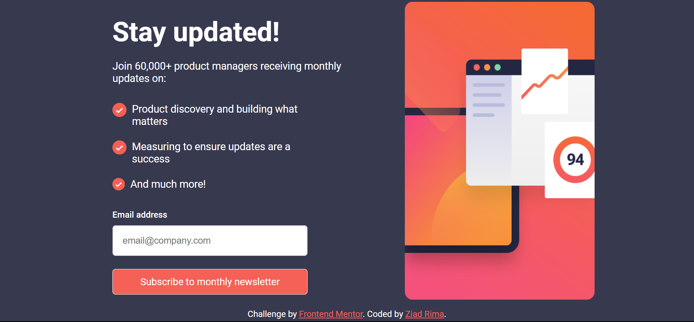

# Frontend Mentor - Newsletter sign-up form with success message solution

This is a solution to the [Newsletter sign-up form with success message challenge on Frontend Mentor](https://www.frontendmentor.io/challenges/newsletter-signup-form-with-success-message-3FC1AZbNrv). Frontend Mentor challenges help you improve your coding skills by building realistic projects. 

## Table of contents

- [Overview](#overview)
  - [The challenge](#the-challenge)
  - [Screenshot](#screenshot)
  - [Links](#links)
- [My process](#my-process)
  - [Built with](#built-with)
  - [Continued development](#continued-development)
  - [Useful resources](#useful-resources)
- [Author](#author)

## Overview

### The challenge

Users should be able to:

- Add their email and submit the form
- See a success message with their email after successfully submitting the form
- See form validation messages if:
  - The field is left empty
  - The email address is not formatted correctly
- View the optimal layout for the interface depending on their device's screen size
- See hover and focus states for all interactive elements on the page

### Screenshot




### Links

- [Solution URL](https://www.frontendmentor.io/solutions/responsive-newsletter-sign-up-form-with-success-message-Hnb70_xq0y)
- [Live Site URL](https://signupfrontend.netlify.app/)

## My process

For this project, I followed a mobile-first approach, starting with a width of 360px. I then used media queries to adjust the layout for larger devices. Once I had completed both pages and most of the layouts, I moved on to main.js to add the necessary functionality. This time, I successfully managed to implement the functionality. I validated the email address input using a method similar to one I used in a prior project and made the Dismiss message button functional. I also made a few tweaks to the code to meet the specific needs and requirements of the site.
```js
form.addEventListener('submit', (e) => {
  e.preventDefault()

  const isEmailValid = validateEmail(email);

    if (isEmailValid) {
      formContainer.style.display = 'none';
      successMessage.style.display = 'flex';
      emailInput.innerHTML = email.value.trim();
      dismissButton.removeEventListener('click', dismissHandler);             
      dismissButton.addEventListener('click', dismissHandler);
    }

    function dismissHandler(e) {
      e.preventDefault();
      form.reset();
      successMessage.style.display = 'none';
      formContainer.style.display = 'grid';
    };     
})
```

### Built with

- Semantic HTML5 markup
- CSS custom properties
- JavaScript
- Flexbox
- CSS Grid
- Mobile-first workflow

### Continued development

Throughout the process, I encountered several challenges, but I realized the importance of structuring the HTML document properly from the start. This makes it much easier to style, especially when ensuring responsiveness. Proper HTML structure will save developers from needing to restructure or assign different class names to elements later on.

### Useful resources

- [SVG Reader](https://www.svgviewer.dev/) - This helped me see and modify the SVG files included with the project,
- [Convert SVG to other formats](https://svgtopng.com/) - This has helped me a lot during the painful process of trying to properly set the svg in their proper form by converting the svg to png and save me the trouble.

## Author

- GitHub - [ziad-rima](https://github.com/ziad-rima)
- Frontend Mentor - [@ziad-rima](https://www.frontendmentor.io/profile/ziad-rima)
- X - [@rima4082](https://x.com/rima4082)
